# 🚀 JobShield: Fake Job Posting Detection Using NLP & Machine Learning


---

# 📌 Project Overview

Fake job postings have become a serious issue in online recruitment platforms. Fraudulent job advertisements mislead candidates, steal personal information, and create financial scams.

This project uses **Natural Language Processing (NLP)** and **Machine Learning algorithms** to automatically detect whether a job posting is genuine or fraudulent based on textual information such as:

- Job title
- Description
- Requirements
- Benefits

The system performs:
- Exploratory Data Analysis (EDA)
- Data Cleaning
- NLP Text Preprocessing
- TF-IDF Vectorization
- Machine Learning Classification
- Model Evaluation
- Confusion Matrix Visualization

---

# 🎯 Business Problem

Recruitment websites receive thousands of job postings daily. Manual verification of every post is difficult and time-consuming.

### This project addresses:

✅ Detection of fraudulent job postings  
✅ Reduction of online recruitment scams  
✅ Improved trust in hiring platforms  
✅ Faster automated verification process  
✅ Data-driven fraud prevention system  

---

# 🧠 Business Questions Addressed

- What percentage of job postings are fake?
- Which employment types are most common?
- How much missing data exists in the dataset?
- Can NLP detect hidden fraud patterns in job descriptions?
- Which machine learning model performs best for fake job detection?

---

# 📂 Dataset Information

### Dataset Name:
Fake Job Postings Dataset

### Source:
Kaggle Dataset

### Total Records:
17,880 Job Postings

### Total Features:
18 Columns

---

# 📊 Dataset Features

| Feature | Description |
|---|---|
| title | Job title |
| location | Job location |
| department | Department name |
| salary_range | Salary information |
| company_profile | Company description |
| description | Job description |
| requirements | Required skills |
| benefits | Job benefits |
| employment_type | Full-time / Part-time |
| required_experience | Experience level |
| required_education | Education requirement |
| industry | Industry name |
| function | Job function |
| fraudulent | Target variable |

---

# 🛠️ Tools & Technologies Used

| Category | Technologies |
|---|---|
| Programming Language | Python |
| Data Analysis | Pandas, NumPy |
| Visualization | Matplotlib, Seaborn |
| NLP | NLTK |
| ML Models | Logistic Regression, Naive Bayes, Random Forest |
| Vectorization | TF-IDF |
| IDE | Jupyter Notebook |
| Dashboard | Power BI |
| Version Control | Git & GitHub |

---

# 🏗️ Project Architecture

```text
Data Collection
       ↓
Data Cleaning
       ↓
Exploratory Data Analysis
       ↓
Handling Missing Values
       ↓
Text Preprocessing
       ↓
Regex Cleaning
       ↓
Tokenization
       ↓
Stopword Removal
       ↓
TF-IDF Vectorization
       ↓
Train-Test Split
       ↓
Model Training
       ↓
Model Evaluation
       ↓
Prediction & Dashboard
```

---

# 📈 Exploratory Data Analysis (EDA)

EDA was performed to understand:
- Dataset structure
- Null values
- Fraud distribution
- Employment type distribution
- Feature relationships

---

## 📷 Importing Libraries

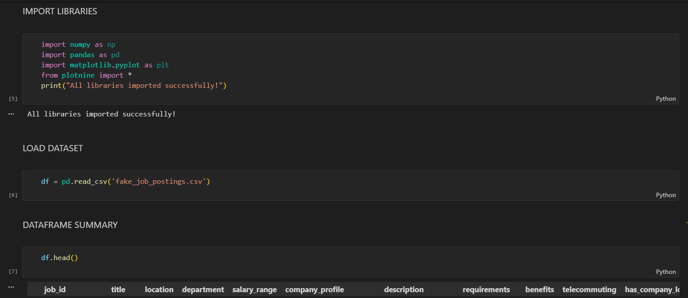

Libraries used:
- NumPy
- Pandas
- Matplotlib
- Plotline

---

## 📷 Loading Dataset


Dataset loaded using Pandas.

```python
df = pd.read_csv('fake_job_postings.csv')
```

---

## 📷 Dataset Preview


Displayed the first few rows of the dataset using:

```python
df.head()
```

---

## 📷 Exploratory Data Analysis

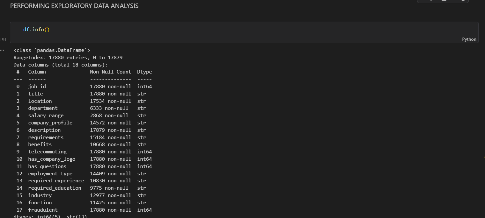

Used:
```python
df.info()
df.describe()
```

Key observations:
- Dataset contains both numerical and categorical columns
- Several columns contain missing values
- Fraudulent class is imbalanced

---

## 📷 Dataset Shape & Columns

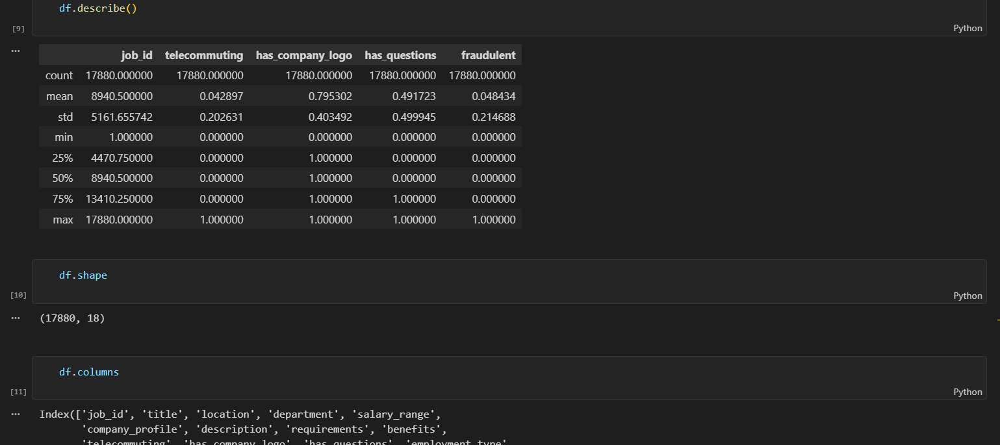

Dataset dimensions:

```python
(17880, 18)
```

---

## 📷 Fraudulent vs Real Job Postings

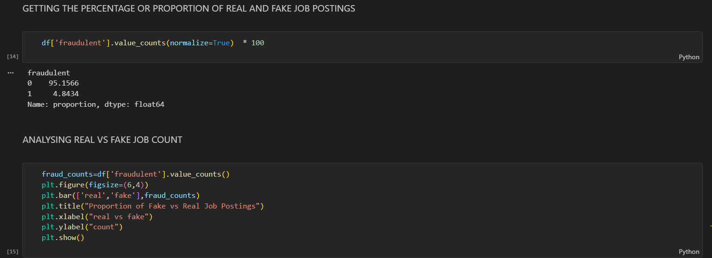

### Key Insight:
- Approximately 95% postings are real
- Around 5% postings are fraudulent

This indicates:
- Highly imbalanced classification problem

---

## 📷 Employment Type Distribution

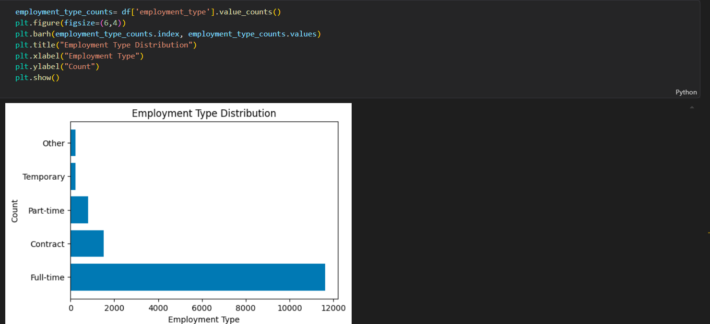

### Observation:
- Full-time jobs dominate the dataset
- Contract and temporary jobs appear less frequently

---

# 🧹 Data Cleaning & Preprocessing

---

## 📷 Missing Value Analysis

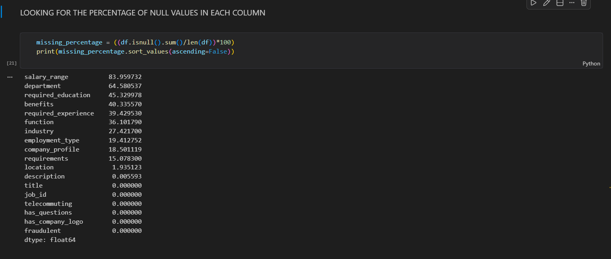

Several columns contained null values.

Major missing columns:
- salary_range
- department
- benefits
- required_education

---

## 📷 Missing Value Percentage


Calculated percentage of missing values using:

```python
(df.isnull().sum()/len(df))*100
```

---

## 📷 Handling Missing Values

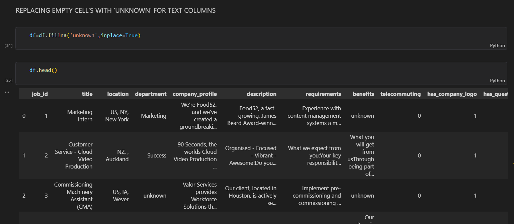

Missing text values replaced with:

```python
'unknown'
```

---

# ⚙️ Feature Engineering

---

## 📷 Merging Text Columns

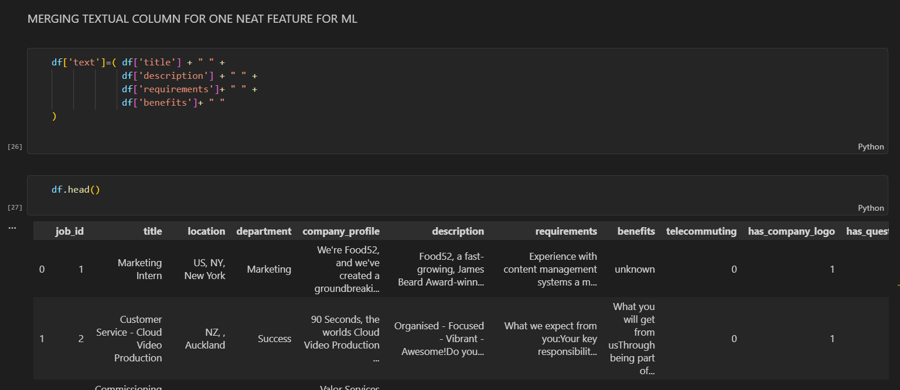

Combined important textual columns into one feature:

```python
title + description + requirements + benefits
```

Purpose:
- Improve NLP understanding
- Create richer textual context

---

# 🧠 NLP Preprocessing

---

## 📷 Regex Text Cleaning

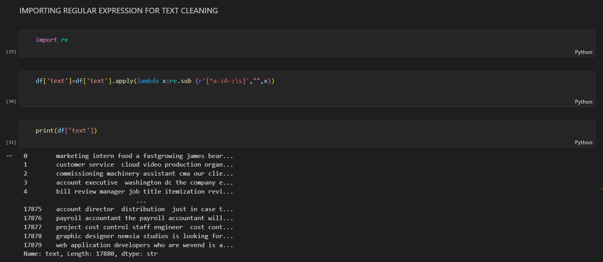

Used Regular Expressions to:
- Remove special characters
- Remove punctuation
- Keep only alphabets

```python
re.sub('[^a-zA-Z\s]', '', x)
```

---

## 📷 Installing NLTK

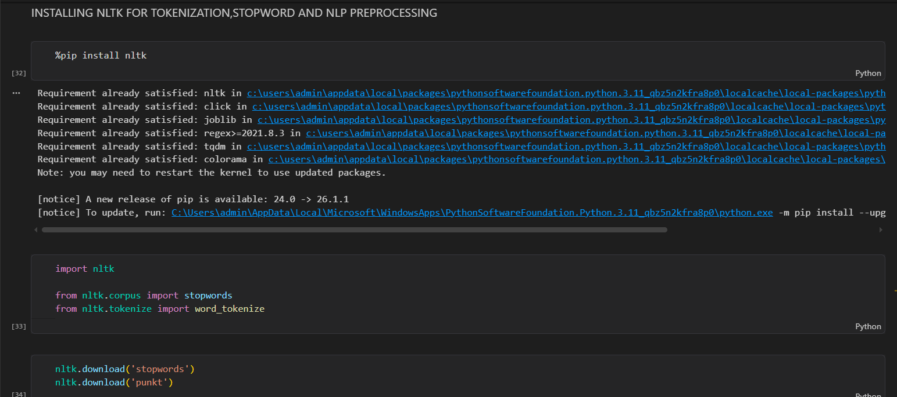

NLTK used for:
- Tokenization
- Stopword removal
- NLP preprocessing

---

## 📷 Stopwords Removal & Tokenization

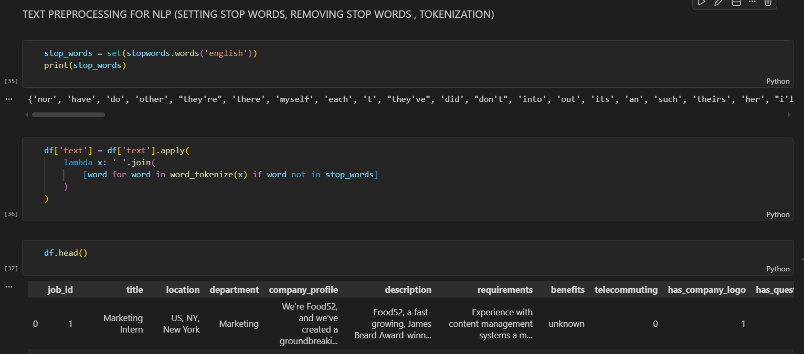

Performed:
- Tokenization
- Stopword removal
- Text normalization

---

# 🔢 TF-IDF Vectorization

---

## 📷 TF-IDF Transformation

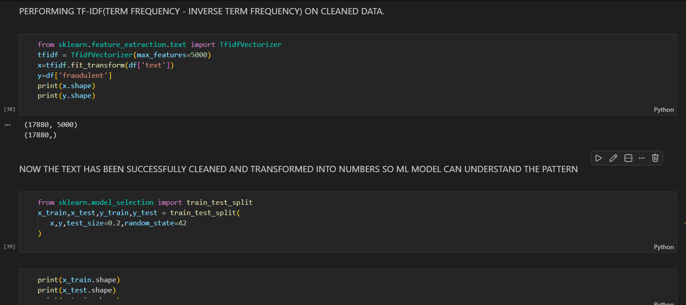

Converted text into numerical vectors using:

```python
TfidfVectorizer(max_features=5000)
```

### Why TF-IDF?
TF-IDF helps machine learning models understand:
- Important words
- Rare but meaningful terms
- Frequency significance

---

# 🔀 Train-Test Split

---

## 📷 Splitting Dataset


Dataset split:
- 80% Training
- 20% Testing

```python
train_test_split(test_size=0.2)
```

---

# 🤖 Machine Learning Models

---

# 1️⃣ Logistic Regression Model

## 📷 Logistic Regression Training

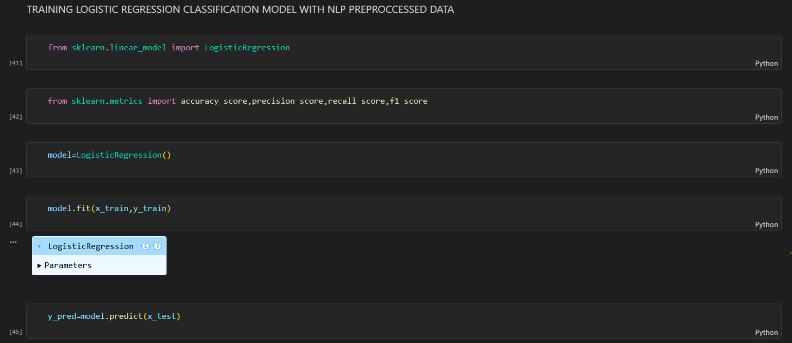

### Purpose:
Binary classification model for fraud prediction.

### Performance:
- High accuracy
- Good precision
- Strong baseline model

---

# 2️⃣ Naive Bayes Model

## 📷 Naive Bayes Training

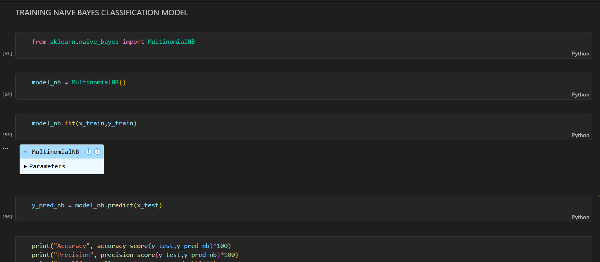

### Purpose:
Probabilistic NLP classification algorithm.

### Strength:
- Fast
- Efficient for text classification

---

# 3️⃣ Random Forest Model

## 📷 Random Forest Training

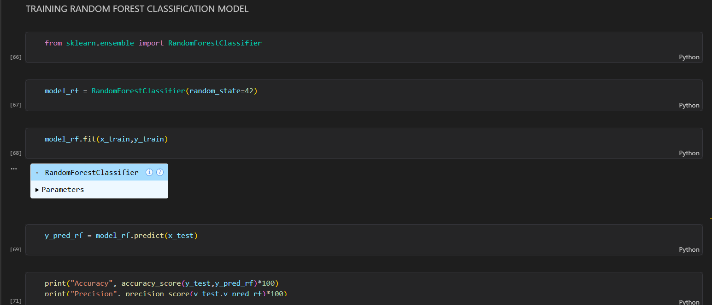

### Purpose:
Ensemble learning model using decision trees.

### Advantages:
- Better generalization
- Reduces overfitting
- High predictive performance

---

# 📊 Confusion Matrix Analysis

Confusion matrices were generated for:
- Logistic Regression
- Naive Bayes
- Random Forest

These matrices helped evaluate:
- True Positives
- True Negatives
- False Positives
- False Negatives

---

# 📈 Model Evaluation Metrics

The following metrics were used:

| Metric | Purpose |
|---|---|
| Accuracy | Overall correctness |
| Precision | Fraud detection precision |
| Recall | Ability to detect fraud |
| F1 Score | Balance between precision & recall |

---

# 🧾 Final Prediction Dataset

## 📷 Final Output Dataset

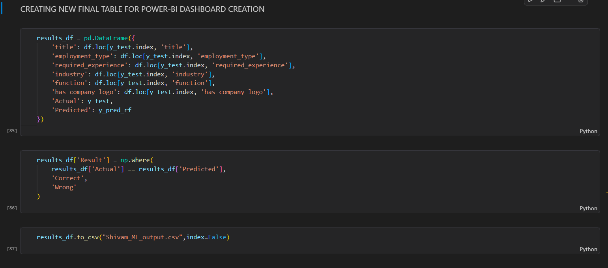

Generated final output table containing:
- Actual values
- Predicted values
- Correct/Wrong prediction status

Exported as:

```python
results_df.to_csv("Shivam_ML_output.csv")
```

---

# 📌 Key Analytical Insights

✅ Fake job postings represent a very small but critical portion of the dataset.

✅ Text preprocessing significantly improved model understanding.

✅ TF-IDF successfully transformed textual data into machine-readable vectors.

✅ Random Forest achieved strong predictive capability.

✅ NLP techniques effectively captured fraud-related language patterns.

---

# 📁 Repository Structure

```text
Fake-Job-Posting-Detection/
│
├── data/
│   └── fake_job_postings.csv
│
├── images/
│   ├── Image1.png
│   ├── Image2.png
│   ├── ...
│
├── notebooks/
│   └── fake_job_detection.ipynb
│
├── outputs/
│   └── Shivam_ML_output.csv
│
├── README.md
├── requirements.txt
└── .gitignore
```

---

# ▶️ How To Run The Project

## Step 1

Clone repository

```bash
git clone https://github.com/Shivam-data-analytics/JobShield-ML-Fake-Job-Detector.git
```

---

## Step 2

Install dependencies

```bash
pip install -r requirements.txt
```

---

## Step 3

Run notebook

```bash
jupyter notebook
```

---

# 📦 Requirements

```txt
numpy
pandas
matplotlib
seaborn
nltk
scikit-learn
jupyter
```

---

# 📊 Power BI Dashboard

A Power BI dashboard was also created using prediction outputs to visualize:
- Fraudulent postings
- Employment type analysis
- Model prediction distribution
- Industry-wise analysis

---

# 🚀 Project Impact

This project demonstrates how:
- NLP can solve real-world fraud problems
- Machine Learning automates scam detection
- Text analytics improves cybersecurity systems
- AI enhances recruitment platform reliability

---

# 🔮 Future Improvements

- Deep Learning Models
- LSTM / Transformers
- Deployment using Flask or Streamlit
- Real-time job fraud detection API
- Cloud deployment

---

# 👨‍💻 Author

## Shivam Yadav

Aspiring Data Analyst & Machine Learning Enthusiast

### Skills:
- Python
- SQL
- Power BI
- Excel
- Machine Learning
- NLP
- Data Visualization

---

# ⭐ If You Found This Project Useful

Please consider:
- Starring the repository ⭐
- Forking the project 🍴
- Sharing feedback 📢

---

# 📬 Contact

Feel free to connect for collaboration, learning, or opportunities.

---
